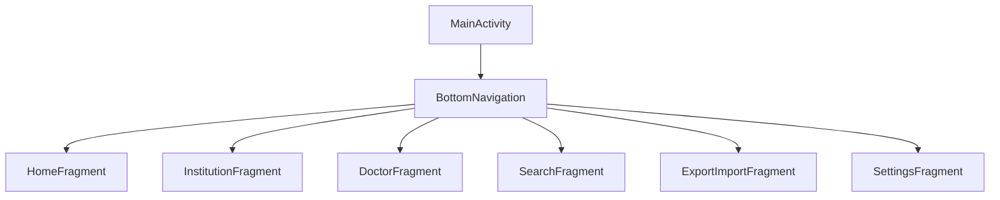
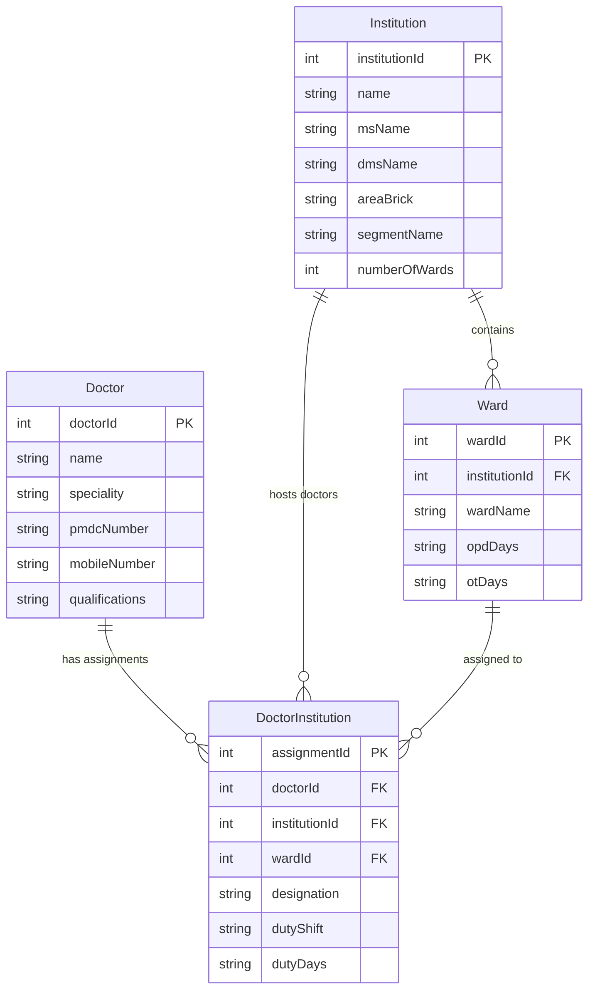

# Design Document

## Overview

The Offline Doctor & Institution Tracker is an Android native application built using Kotlin with MVVM architecture. The app provides comprehensive offline management of healthcare professionals and institutions, featuring local SQLite storage, advanced search capabilities, and data export/import functionality. The design emphasizes performance, offline reliability, and intuitive user experience following Material3 guidelines.

## Architecture

### MVVM Pattern
The application follows the Model-View-ViewModel (MVVM) architectural pattern:

- **Model**: Room database entities and repositories for data management
- **View**: Jetpack Compose UI components and activities
- **ViewModel**: Business logic and UI state management with LiveData/StateFlow

### Technology Stack
- **Language**: Kotlin
- **UI Framework**: Jetpack Compose with Material3
- **Database**: SQLite with Room ORM
- **Architecture Components**: ViewModel, LiveData, Navigation Component
- **Dependency Injection**: Hilt
- **Async Operations**: Coroutines and Flow
- **File Operations**: Android Storage Access Framework

## Components and Interfaces

### Database Layer

#### Room Database
```kotlin
@Database(
    entities = [Doctor::class, Institution::class, Ward::class, DoctorInstitution::class],
    version = 1,
    exportSchema = false
)
abstract class AppDatabase : RoomDatabase()
```

#### Repository Pattern
- `DoctorRepository`: Manages doctor CRUD operations and assignments
- `InstitutionRepository`: Handles institution and ward management
- `SearchRepository`: Optimized queries for filtering and search
- `ExportImportRepository`: Data serialization and file operations

### UI Layer

#### Navigation Structure


#### Screen Components
- **HomeScreen**: Quick search, shortcuts, recent updates
- **InstitutionScreen**: Institution list, add/edit forms, ward management
- **DoctorScreen**: Doctor list, assignment management, qualification handling
- **SearchScreen**: Advanced filtering UI with saved filters
- **ExportImportScreen**: File operations and data management
- **SettingsScreen**: App preferences and data management

### ViewModel Layer

#### Core ViewModels
- `HomeViewModel`: Dashboard data and quick actions
- `InstitutionViewModel`: Institution and ward state management
- `DoctorViewModel`: Doctor data and assignment logic
- `SearchViewModel`: Filter state and search results
- `ExportImportViewModel`: File operations and data validation
- `SettingsViewModel`: App preferences and theme management

## Data Models

### Entity Relationships


### Data Validation
- **Doctor**: Name (required), PMDC number (unique), mobile number (format validation)
- **Institution**: Name (required), area brick (required), number of wards (positive integer)
- **Ward**: Ward name (required), OPD/OT days (valid day names)
- **Assignment**: All foreign keys must exist, duty shift enum validation

### Type Converters
Room type converters for complex data types:
- `List<String>` for qualifications, OPD days, OT days, duty days
- Enum converters for duty shifts
- Date converters for timestamps

## Search and Filtering

### Search Strategy
- **Primary Search**: Full-text search on doctor names and institution names
- **Filter Combinations**: Multiple filter criteria with AND logic
- **Indexing**: Database indexes on frequently searched fields
- **Performance**: Pagination for large result sets

### Filter Categories
1. **Doctor Filters**: Speciality, designation, duty shift
2. **Location Filters**: Area brick, institution name
3. **Schedule Filters**: OPD days, OT days, duty days
4. **Saved Filters**: User-defined filter combinations

### Search Performance Optimization
- Database indexes on searchable fields
- Efficient query construction with Room
- Result caching for repeated searches
- Background search execution with coroutines

## Export/Import System

### File Format Support
- **JSON**: Complete data structure preservation
- **CSV**: Tabular format for spreadsheet compatibility

### Export Features
- Full database export
- Filtered result export
- Individual entity export (doctors, institutions)
- Metadata inclusion (export date, app version)

### Import Features
- Data validation before import
- Duplicate detection and handling
- Merge strategies (replace, skip, update)
- Import progress tracking

### File Management
- Local storage in app-specific directories
- File sharing via Android's sharing framework
- Backup file naming with timestamps

## User Interface Design

### Material3 Implementation
- Dynamic color theming
- Adaptive layouts for different screen sizes
- Consistent component usage (Cards, FABs, Navigation)
- Accessibility compliance (content descriptions, focus management)

### Navigation Pattern
- Bottom navigation for main sections
- Fragment-based navigation with Navigation Component
- Deep linking support for direct access
- Back stack management

### UI State Management
- Loading states for database operations
- Error handling with user-friendly messages
- Empty states with actionable guidance
- Success feedback for user actions

## Error Handling

### Database Errors
- Connection failures: Retry mechanisms
- Constraint violations: User-friendly error messages
- Data corruption: Recovery procedures
- Storage full: Cleanup suggestions

### File Operation Errors
- Permission denied: Request appropriate permissions
- File not found: Clear error messaging
- Invalid format: Format validation feedback
- Import failures: Rollback mechanisms

### UI Error Handling
- Network-independent error handling
- Graceful degradation for missing data
- User notification system for critical errors
- Error logging for debugging (local only)

## Testing Strategy

### Unit Testing
- Repository layer testing with Room in-memory database
- ViewModel testing with test coroutines
- Utility function testing (converters, validators)
- Business logic validation

### Integration Testing
- Database migration testing
- Export/import workflow testing
- Search functionality testing
- UI navigation testing

### UI Testing
- Jetpack Compose testing framework
- User interaction flow testing
- Accessibility testing
- Performance testing with large datasets

### Test Data Management
- Mock data generators for testing
- Test database seeding
- Performance benchmarking with 50,000 records
- Memory usage monitoring

## Performance Considerations

### Database Optimization
- Proper indexing strategy
- Query optimization for complex searches
- Lazy loading for large datasets
- Connection pooling and management

### Memory Management
- Efficient list rendering with LazyColumn
- Image loading optimization (if applicable)
- Memory leak prevention in ViewModels
- Garbage collection optimization

### Storage Efficiency
- Database size monitoring
- Efficient data serialization
- Temporary file cleanup
- Storage usage reporting

## Security and Privacy

### Data Protection
- Local-only data storage (no network transmission)
- No sensitive data logging
- Secure file permissions
- Data encryption consideration for future versions

### Privacy Compliance
- No data collection or analytics
- No external service integration
- User control over data export/sharing
- Clear data deletion capabilities